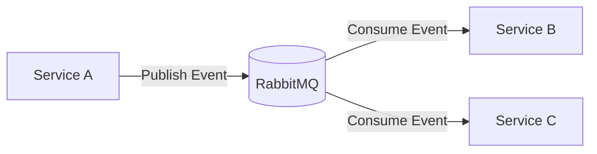
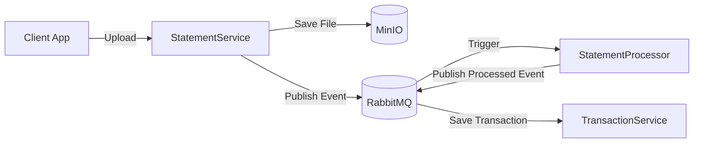

```mermaid
%% 1. Tổng quan hệ thống PFM (High-level Architecture)
flowchart LR
  subgraph API Gateway (Ocelot)
    direction TB
    APIGW[API Gateway]
  end

  subgraph Message Bus
    direction TB
    MQ[RabbitMQ]
  end

  %% Identity & Access
  subgraph Identity & Access
    direction LR
    Auth[AuthService]
    User[UserService]
    Role[RoleService]
    dbI[(db_identity)]
  end

  %% Core Finance
  subgraph Core Finance
    direction LR
    Acc[AccountService]
    Tx[TransactionService]
    Stm[StatementService]
    dbF[(db_finance)]
  end

  %% Money Management
  subgraph Money Management
    direction LR
    Budget[BudgetService]
    Jar[JarService]
    Shared[SharedExpenseService]
    dbM[(db_money)]
  end

  %% Planning & Investment
  subgraph Planning & Investment
    direction LR
    Debt[DebtService]
    Goal[GoalService]
    Inv[InvestmentService]
    dbP[(db_planning)]
  end

  %% Reporting & Integration
  subgraph Reporting & Integration
    direction LR
    Rep[ReportingService]
    Noti[NotificationService]
    Intg[IntegrationService]
    dbR[(db_reporting)]
  end

  %% Connections: API Gateway -> Services
  APIGW --> Auth
  APIGW --> User
  APIGW --> Role
  APIGW --> Acc
  APIGW --> Tx
  APIGW --> Stm
  APIGW --> Budget
  APIGW --> Jar
  APIGW --> Shared
  APIGW --> Debt
  APIGW --> Goal
  APIGW --> Inv
  APIGW --> Rep
  APIGW --> Noti
  APIGW --> Intg

  %% Services -> their DBs
  Auth --> dbI
  User --> dbI
  Role --> dbI
  Acc --> dbF
  Tx --> dbF
  Stm --> dbF
  Budget --> dbM
  Jar --> dbM
  Shared --> dbM
  Debt --> dbP
  Goal --> dbP
  Inv --> dbP
  Rep --> dbR
  Noti --> dbR
  Intg --> dbR

  %% Message Bus integration
  Auth -->|Publish/Consume| MQ
  User -->|Publish/Consume| MQ
  Role -->|Publish/Consume| MQ
  Acc -->|Publish/Consume| MQ
  Tx -->|Publish/Consume| MQ
  Stm -->|Publish/Consume| MQ
  Budget -->|Publish/Consume| MQ
  Jar -->|Publish/Consume| MQ
  Shared -->|Publish/Consume| MQ
  Debt -->|Publish/Consume| MQ
  Goal -->|Publish/Consume| MQ
  Inv -->|Publish/Consume| MQ
  Rep -->|Publish/Consume| MQ
  Noti -->|Publish/Consume| MQ
  Intg -->|Publish/Consume| MQ
```



