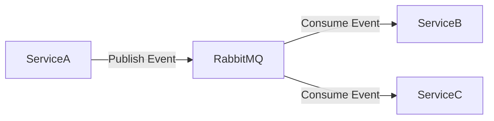
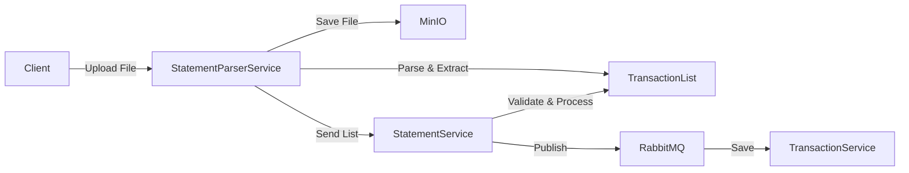

# PFM System Architecture v4

## 1. Tổng quan hệ thống

Hệ thống PFM được thiết kế theo kiến trúc microservices, với các bounded context rõ ràng và độc lập. Mỗi service có database riêng và giao tiếp thông qua API Gateway và message bus.

## 2. Các Bounded Context và Microservices

### 2.1 Identity & Access
- **AuthService**: Xác thực và phân quyền (Auth/OpenIddict)
- **UserService**: Quản lý thông tin người dùng
- **RoleService**: Quản lý vai trò và quyền hạn
- **Database**: db_identity (PostgreSQL)

### 2.2 Core Finance
- **AccountService**: Quản lý tài khoản
- **TransactionService**: Xử lý giao dịch
- **StatementService**: Quản lý sao kê và import từ danh sách giao dịch
- **Database**: db_finance (PostgreSQL)

### 2.3 Money Management
- **BudgetService**: Quản lý ngân sách
- **JarService**: Quản lý SixJars
- **SharedExpenseService**: Quản lý chi tiêu chia sẻ
- **Database**: db_money (PostgreSQL)

### 2.4 Planning & Investment
- **DebtService**: Quản lý khoản nợ
- **GoalService**: Quản lý mục tiêu tài chính
- **InvestmentService**: Quản lý đầu tư
- **Database**: db_planning (PostgreSQL)

### 2.5 Reporting & Integration
- **ReportingService**: Tạo báo cáo và phân tích
- **NotificationService**: Gửi thông báo
- **IntegrationService**: Kết nối với các dịch vụ bên ngoài
- **StatementParserService**: Phân tích và trích xuất dữ liệu từ file sao kê
- **Database**: db_reporting (PostgreSQL)

## 3. Kiến trúc giao tiếp

### 3.1 API Gateway (Ocelot)
- Định tuyến request đến các service
- Xác thực và phân quyền
- Rate limiting và circuit breaking
- API versioning

### 3.2 Message Bus (RabbitMQ)
- Xử lý các sự kiện bất đồng bộ
- Đảm bảo tính nhất quán dữ liệu
- Hỗ trợ retry và dead letter queue

### 3.3 Event Flow

## 4. Xử lý dữ liệu

### 4.1 Import Statement Flow (Updated)

### 4.2 Data Synchronization
- Event-driven synchronization
- Change Data Capture (CDC)
- Dual-write pattern với fallback

## 5. Bảo mật

### 5.1 Authentication
- OpenID Connect
- JWT tokens
- OAuth 2.0

### 5.2 Authorization
- Role-based access control (RBAC)
- Claims-based authorization
- Policy-based authorization

## 6. Monitoring & Logging

### 6.1 Health Checks
- Service health endpoints
- Database connectivity
- External service dependencies

### 6.2 Metrics
- Prometheus metrics
- Grafana dashboards
- Custom business metrics

### 6.3 Logging
- Centralized logging (ELK/EFK)
- Structured logging
- Correlation IDs

## 7. Deployment & DevOps

### 7.1 Containerization
- Docker containers
- Docker Compose cho development
- Kubernetes cho production

### 7.2 CI/CD
- Automated testing
- Container registry
- Deployment automation

### 7.3 Infrastructure
- Infrastructure as Code
- Cloud-native design
- Auto-scaling

## 8. Lộ trình triển khai

### 8.1 Phase 1: Core Services
- Identity & Access
- Core Finance
- Basic Reporting

### 8.2 Phase 2: Money Management
- Budget Management
- SixJars
- Shared Expenses

### 8.3 Phase 3: Planning & Investment
- Debt Management
- Financial Goals
- Investment Tracking

### 8.4 Phase 4: Advanced Features
- Advanced Reporting
- External Integrations
- AI/ML Features
- Statement Parser

## 9. Best Practices

### 9.1 Development
- Clean Architecture
- Domain-Driven Design
- SOLID principles
- Unit testing
- Integration testing

### 9.2 Operations
- Blue-Green deployment
- Canary releases
- Feature flags
- Disaster recovery
- Backup strategies

### 9.3 Security
- Regular security audits
- Dependency scanning
- Penetration testing
- Security headers
- Data encryption 